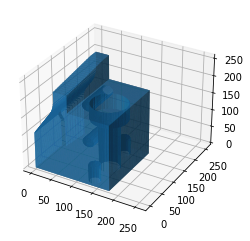

# CAD Operation Sequence

Predict sequence of operations from given .binvox files.

# Data

- Number of data points : 255
- Input data shape : (255, 256, 256, 256)
- Labels Shape : (255, 17)

# Missing Files

Files that doesn't exists: 
 1. 1160117_10.binvox
 2. 1160669_20.binvox
 3. 1160908_20.binvox (.obj file present)
 4. 1152491_10.binvox (.obj file present)
 5. 1162720_10.binvox

# Visualization of a Data Point



# Data Set

- Download the Vorplan dataset and unzip in ./data_vorplan folder. The dataset should be in the form of .binvox files.

# Train the network

```python
python training_transformer.py
```
